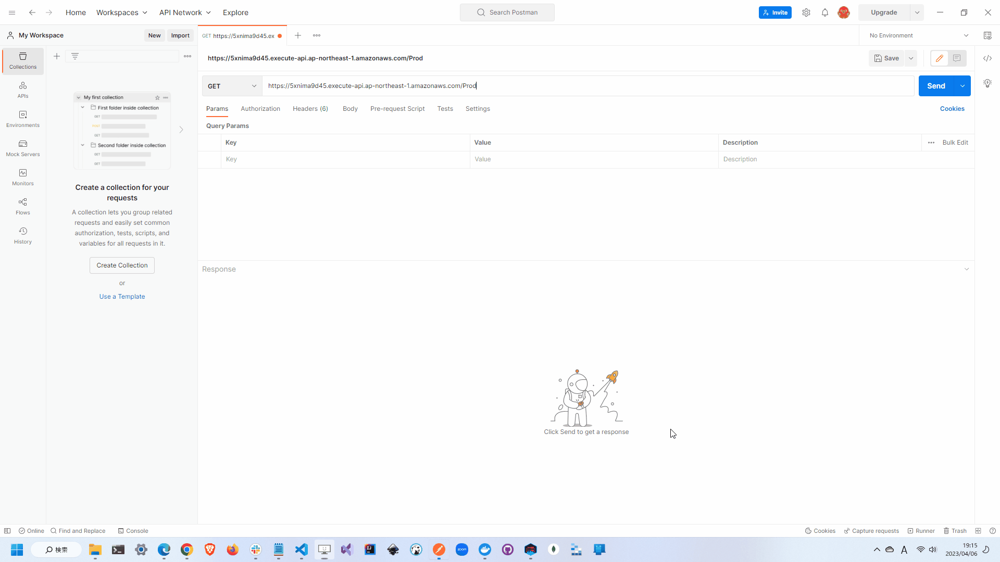

# learning-DynamoDB

🍞🍞🍞 Dynamo DBの学習用リポジトリです。  

  

## 準備

以下のGitHub Secretsを設定します。  

| Name | Value |
| --- | --- |
| AWS_ACCESS_KEY_ID | AWSアクセスキー |
| AWS_SECRET_ACCESS_KEY | AWSシークレットキー |
| AWS_REGION | AWSリージョン |

## 開発用実行

```shell
cd ./api
sam build --use-container ;; sam local start-api
```

## 実行する

以下のパスにアクセスします。  

- /{channel_id} (GET)
- /             (POST)
- /{channel_id} (PUT)
- /{channel_id} (DELETE)

`POST`と`PUT`はボディ部に適当なJSONをセットして送信してください。  
